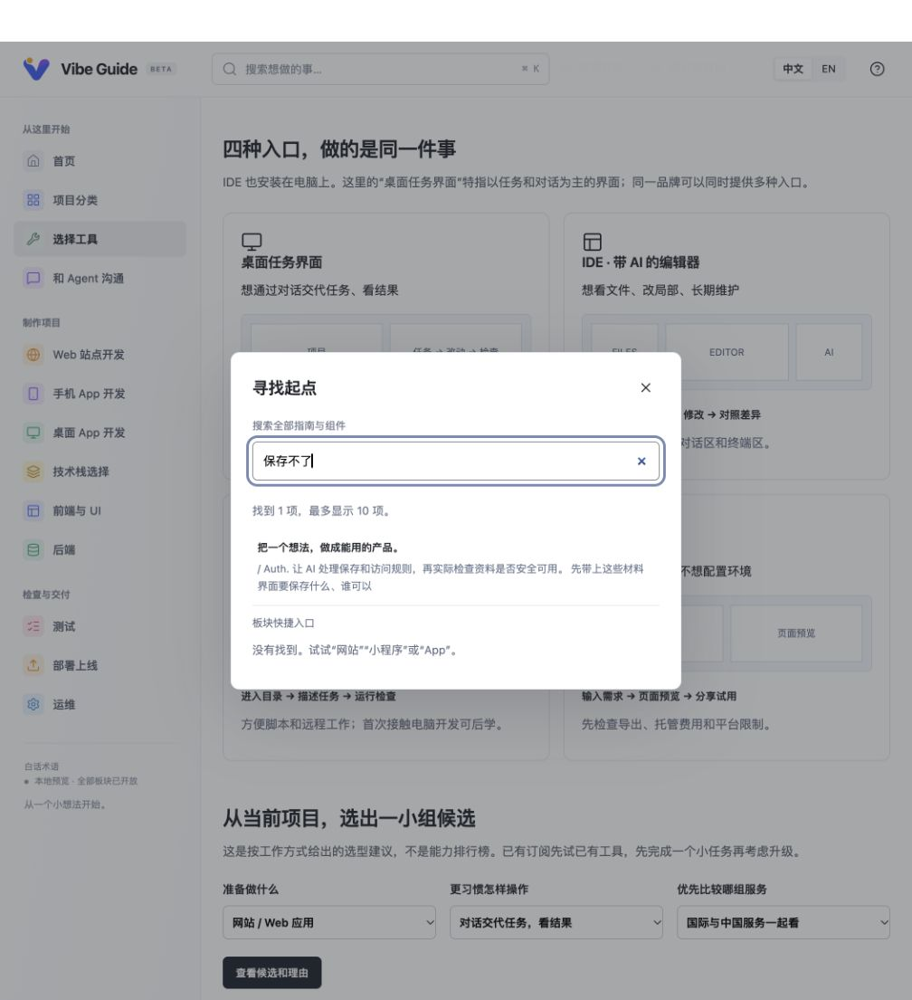

# Vibe Guide：模拟零基础学习者深度体验

体验日期：2026-09-26。对象：用户确认的运行中完整版本 `http://127.0.0.1:4324/zh-cn/`，代码目录 `/Users/rouice/.codex/worktrees/b85c/组件`，体验前提交 `7b108f5`。当前聊天目录中的早期预览版不作为本报告评价对象。

## 1. 我到底能不能跟着做出一个项目？

**有一个已经可用、能修改文件和运行项目的 AI 助手陪着，我能够借助这些材料推进一个很小的本地原型；但这次体验不足以证明，一个从未打开过开发工具的人，单靠这个站点就能独立走完从零到上线。**

站点已经把“如何和 AI 一起做事”讲得相当完整。对我最有用的是：先写自己的想法、缩小第一版、一次只做一项、亲手检查保存是否真的发生。弱点集中在必须由学习者亲自完成的操作、不同页面之间的材料交接、以及没有现成作品可以对照的地方。

“让 AI 写代码”本身符合 Vibe Coding 的目标，并不是缺点。真正需要补齐的是：我把任务发出去以后，如何找到对的入口、认出正确结果、判断异常、把同一个项目继续推进下去。现在这些工作仍较多依赖执行 AI 临场当老师。

这次确实做出了一个隔离的学习记录练习，实际验证了空白提示、新增保存、刷新保留和关闭标签页后重开保留。但是，具体代码、浏览器保存方式、启动命令由执行 AI 补充，工具安装和账号开通使用了已有环境，并没有作为新手从头完成。它不是完整十三步毕业项目，也不是公开上线成果。

## 2. 体验方法与边界

- 角色设定：不懂代码，很想学，使用 Mac，愿意跟着做；首次目标是只给自己用的“每日学习记录网站”。
- 学习目标：写下学习内容→保存→在历史中看到→刷新后仍在；空内容不能保存。不做登录、同步、支付和公开发布。
- 实际操作：浏览器阅读十三个主节点及三个开发分支；进入工具、工具开工、Git/规则、沟通、技术选型、Web、手机 App、组件、后端、测试、上线、维护等页面；填写表单、生成与读回剪贴板、搜索、刷新、跳转、组件键盘演示、390px 手机视口检查。
- 项目验证：当前执行 AI 根据学习者填写的说明制作最小练习，并通过浏览器操作。没有调用第二个模型做独立盲测，没有招募真实零基础使用者。
- 本文的“我会困惑”“我可能放弃”是角色视角判断；“复制了什么”“刷新后怎样”“搜索去了哪里”是实际观察。两者不混为用户研究数据。
- 未测试：26 个第三方工具逐一安装/付费、所有 212 个组件、所有排障分支、所有设备、生产发布、安全审计。未核验本次未涉及的外部价格准确性，不据此下结论。
- 工具说明与屏幕中的品牌价格属于站点内容，不是本报告购买建议。

## 3. 从第一次进入到尝试做项目：我的真实体验感受

### 第一眼：我愿意继续，但路线看起来很长

“把一个想法，做成能用的产品”直接回应了我的兴趣。首页没有先让我背编程语言，明确告诉我先写自己的想法，而且不知道的地方可以写“尚未确定”。这对没有经验的人很友好。我不会因为问题没想全就不敢开始。

但是十三个节点和英文术语同时出现，我也会担心：是不是把这些都搞明白才能看到第一张自己的页面？手机上这种压力更强，整张路线纵向排列；第一次填写内容在约 1608px 的位置。点击第一节点可以直接到正文，这个跳转是有效的，但初看仍像一门很长的课。

### 写想法：这是我最有把握的一步

我能把原来的“想做一个学习网站”具体化成：只给自己用，写今天学了什么，保存后能回看，刷新还在。站点的草稿字段确实帮助我表达需求，不是单纯换了几个专业词。

沟通页也确实能把我填的背景、使用者、目标、输入和限制生成一段可复制的话术。实际剪贴板内容包含我的中文材料。这是本次最明确的学习收益：我知道怎么交代一个小任务，也知道不能只说“做得好看一点”。

### 选工具：我开始犹豫，但并不是完全没有引导

网站区分桌面任务界面、IDE、CLI 和网页工具，还告诉我有订阅就先试已有工具，不必一次安装全部。这些提醒有效。默认条件生成了 Codex、Claude / Claude Code、Kimi / Kimi Code 三个候选，确实比直接扔 26 个名字好。

不过当我决定选一个，进入“打开工具，确认能操作项目”，看到的是“按官方入门页创建项目”“用打开文件夹功能打开”“进入项目的 AI 对话”。我理解目的，但仍可能不知道自己现在看到的工具界面要点哪个按钮。前面推荐的三个候选，与实操页举的 Lovable、VS Code + GitHub Copilot 也不是同一组。它们不矛盾，却不能构成一条无需重新判断的连续路线。

### Git 和规则：保护措施很好，但我还没获得第一份成就感

站点解释了 Git 的用途、项目根目录和 AGENTS.md，并提供整段模板，甚至要求核验规则是否真正读取。这比只说“先配环境”具体很多。

但我此时还没有做出一个可见页面，就要面对 idea.md、Git、规则文件、需求、设计、任务表、初始提交、恢复记录。我会照着复制，却未必能判断 AI 返回的一长段结果是否真的符合要求。这里最缺的不是再多一段提示词，而是一张“准备完成的文件区应是什么样”和一份短的正确结果示例。

### 需求、选型和计划：知道要问什么了，仍不确定怎样算选对

缩小范围的示例“新增→保存→查看”与我的项目十分贴合；把完成标准写成“关闭重开后仍在”也非常有用。

技术选型页面允许写未知，避免逼我瞎选。但填好七个条件后，候选是 React + framework 和 Astro；复制按钮拿到的仍是空白通用模板，没有携带刚填的七个答案。我需要自己再整理一遍。我会问：刚才为什么填？如果遗漏一个答案，AI 会不会推荐另一套方案？

### 制作页面：词典能帮我表达，但我想先看一个完整做成的东西

组件词典能告诉我输入框、标签页等东西叫什么。有演示的下划线标签能切到“账单”，左右键能到“设置”，禁用状态也能看到，非常直观。

我真正需要的“多行输入”只有说明和复刻提示词，没有演示。页面诚实标注了未迁移或验证，但对我来说仍缺少“原来我要的是这个”的视觉确认。提示词还写死了 Notes、Add a note、4–6 行、不自动长高等规格。对于想做中文学习记录的人，我很容易把例子的决定一起带进自己的产品。

Web 路线用了个人作品站作为例子，但仍主要是步骤和提示词。我没有在这条路线看到一组能够连续对照的“最初草稿→生成的文档→第一次页面→一次失败→修复后成品”。因此我知道流程，却不确定自己的每次产物处在什么水平。

### 保存与排错：好习惯开始形成，救援入口仍会迷路

我学会了保存后刷新再看，不能只相信“保存成功”。但我已选择只在本机保存，后端独立页面却要求换设备读取、用两个普通身份和管理身份试验。我不知道哪些可以跳过，是否必须做账号才能算完成。

遇到“保存不了”，我去搜索。搜索确实命中了首页里与保存有关的文字，但打开结果回到第一步写想法，没有带我到保存的节点。搜索框还同时显示“找到 1 项”和“没有找到”。这时不是我缺乏学习欲，而是求助入口没有把我送到正确位置。

### 测试、上线和维护：意识更完整，独立操作还不够

这几页让我知道：构建通过不代表好用，本机地址不等于别人能打开，备份文件也不等于真的能恢复。这些观念值得保留。

但准备正式网址时，站点仍让我交给 AI 核验账号、托管、配置和发布。对于第一次的人，我需要至少一条指定工具与平台的完整演示，知道授权之后应看到什么、没有看到时返回哪一步。本次没有执行公开部署，因此不能说我已经学会并做成上线。

## 4. 实际小练习：到底做到了哪一步

学习者在站内生成的完整提示词保留于 [generated-prompt.txt](./generated-prompt.txt)。隔离练习位于 [exercise/index.html](./exercise/index.html)，运行与边界说明位于 [exercise/README.md](./exercise/README.md)。

| 检查 | 实际动作与结果 | 结论 |
| --- | --- | --- |
| 学习材料生成 | 在沟通表单填写五项真实的模拟项目条件，生成后复制并读回 | 能得到可交给 AI 的任务说明 |
| 范围落地 | 只做一页，输入、保存、历史查看；没有增加登录或同步 | 小目标可由执行 AI 落实 |
| 空内容 | 不填内容直接保存，出现“请先写下学习内容，再保存。” | 已实际通过 |
| 保存 | 输入“今天学会把第一版缩小为：填写、保存、查看。”并保存 | 出现保存提示及历史记录 |
| 刷新 | 刷新相同地址 | 原记录仍在 |
| 关闭再开 | 关闭练习标签页，再打开同一地址 | 原记录仍在；不是退出浏览器进程测试 |
| 学习者独立开工 | 使用现有 AI、现成电脑工具和 Python，代码由执行 AI 编写 | 未验证从零安装与独立开工 |
| 完整工程流程 | 保存了需求/设计边界，但未在练习中重演独立 Git 仓库、规则加载、全部阶段文档与恢复演练 | 不声称完整十三步通过 |
| 正式上线 | 未注册平台、未购买服务、未推送或发布 | 未验证 |

执行 AI 补充的决定包括：不用框架的单页实现、浏览器本地存储、同源地址的保存边界、Python 本地服务及端口、错误时保留输入。这些决定合理与否可以继续检验，但不能把它们算成站点已经明确教给初学者的内容。该练习证明可以在 AI 支持下完成一个窄范围结果，没有证明教程完整性。

## 5. 卡点完整登记

优先级：高＝会明显阻碍关键任务或把学习者带错位置；中＝可绕过，但增加判断/重复劳动；低＝局部体验与表达问题。下面不把所有体验问题都称作代码缺陷。

| 编号 | 页面/位置与证据 | 对我的影响 | 类型 / 优先级 | 建议与验收方式 |
| --- | --- | --- | --- | --- |
| 01 | `/communicate/tools/`：具体操作停在“按官方入门页创建项目”“打开文件夹”“进入该项目的 AI 对话” | 第一次打开软件仍不知道点哪里；这是制作前最早可能停住的位置 | 教学缺口 / 高 | 为一个主工具提供从安装后界面到创建 tool-check.md 的连续操作图；新手不经作者解释能找到文件 |
| 02 | `/tools/` 默认推荐 Codex、Claude、Kimi；实操页例子是 Lovable、VS Code + Copilot | 选定工具之后还要自行匹配另一套示例，不能顺着选择一直走 | 连续性 / 中 | 从所选工具进入对应开工页；至少明确通用步骤与本工具按钮的对应关系 |
| 03 | 首页第 2～8 步先后需要草稿、Git、规则、需求、设计、计划，最小可运行页面在第 8 步 | 没看到成果前先处理大量文件和确认，很可能照抄却不理解 | 角色判断 / 中 | 保留完整路线，另给一个极小体验关卡；让学习者先得到可见结果，再补齐工程解释 |
| 04 | Web 路线的个人作品站只有示意、步骤、模板与检查项，本次路径未见完整前后产物 | 我不能对照判断 AI 输出的需求、计划和成品是否合格 | 教学缺口 / 高 | 增加一个同一项目贯穿的成品包，包含真实失败与修复、可运行结果、每阶段输入输出 |
| 05 | `/stacks/` 填完七项条件并生成候选，再复制“让 AI 核对并推荐”，剪贴板没有这些答案，仍是“填写实际设备、预算”等通用内容 | 重复输入，遗漏条件后建议可能变；表单和提示词没有接起来 | 已实测交接缺口 / 高 | 复制内容包含已选七项、未知项和候选理由，能直接交接而不重填 |
| 06 | 选择“经常操作的网页工具／只在本机／普通页面／不分身份／零预算／少照看／无项目”后，结果列 React + framework、Astro，理由多为共享/费用通用提醒 | 名字少了，但没有解释这两个方案对我的单人记录项目具体差在哪 | 推荐解释不足 / 中 | 按当前答案说明首选理由、备选代价和仍需确认事项；“framework”进一步由 AI 明确而非由新手猜 |
| 07 | 首页 backend 分支写“需要共享时再换设备和身份”；独立 `/data/` 却直接要求跨设备读取、两个普通身份和管理身份，排查“刷新后数据消失”也先问另一设备 | 只在本机保存的项目无法满足这组检查；会误以为必须加账号/云保存 | 条件不一致 / 高 | 拆成不保存、本机保存、共享保存；本机路线不以跨设备读取作为成功依据 |
| 08 | 搜索“保存不了”：结果链接实际为 `/zh-cn/`，点击后出现第一步想法草稿；摘要却在讲保存和权限 | 有命中但到不了问题，排查被迫从头找 | 已实测检索落点问题 / 高 | 搜索结果带节点锚点并展开对应内容，或返回独立排障页；点击后直接看到保存问题 |
| 09 | 搜索“刷新后数据消失”显示找到 2 项、“保存不了”显示找到 1 项；两次下方同时出现“没有找到。试试网站、小程序或 App” | 不确定到底搜到了没有，提示会误导我改搜无关大词 | 已实测状态歧义 / 中 | 将下方文案明确为“没有匹配的板块快捷入口”，有全文命中时不显示笼统失败提示 |
| 10 | `/data/` 填写检查记录、复制成功后刷新，恢复为空白模板；页面确实提前提示刷新会清空 | 正在边学边填时需额外记得复制，否则劳动丢失；这是已说明的限制，不是偷偷丢数据 | 已实测体验限制 / 中 | 支持本机草稿/下载，或离开前提醒；仍清晰区分学习标记与真实验证结果 |
| 11 | 首页每步模板重复要求背景、使用者和材料；当前材料要自行从外部文件带回；回首页会重新显示第一步 | 不知道自己已经完成哪一步，频繁在笔记、工具和网页之间搬材料 | 连续学习负担 / 中 | 给出项目材料清单与继续学习入口；允许记录学习位置，但不要把勾选当验证通过 |
| 12 | `/components/` 搜“写日记”为 0，提示换短名称；改搜“多行”才找到输入组件 | 我正因为不知道组件名才来，仍需先推测一个接近术语的词 | 已实测用途检索缺口 / 中 | 为常见任务补“写长内容、写日记、备注”等别名，提供用途入口和示意缩略图 |
| 13 | `/components/in-area/` 明示交互演示尚未迁移或验证；只有“长文本”和提示词 | 不能直观看到中文长文输入、超长内容或错误状态 | 内容覆盖限制 / 中 | 优先补新手高频组件演示；不必先追求所有变体数量。本站已诚实标记，此点应保留 |
| 14 | 同一多行输入模板含“标签 Notes”“占位 Add a note”“不要默认自动长高”等固定要求 | 复制中文项目时可能把例子规格当已确认需求 | 模板适配风险 / 中 | 区分必要行为和可选示例；标签、占位、行数变成待填项或随项目生成 |
| 15 | `/launch/` 包含版本、账号、费用、配置、正式入口核对，但本次路线没有选定平台的完整发布操作示例 | 我知道要检查什么，却仍不能凭本站步骤独自拿到一个正式网址 | 教学缺口 / 高 | 提供一条范围明确的 Web 发布实操，附每一步画面/结果和失败回退；本机、预览、正式网址明确区分 |
| 16 | 390×844 首次首页：第一个正文节点距文档顶部约 1608px，路线高约 1253px；未见整页横向溢出，点击 01 能跳到正文 | 手机进入后先浏览长路线才知道能做什么；“左侧板块”在手机上实际收进菜单 | 实测布局＋角色判断 / 中 | 顶部增加“开始第 1 步”，手机折叠全路线，文案改为“菜单中的板块”；保留当前位置 |
| 17 | 手机宽度 DOM 中搜索按钮只剩无名称 button；桌面是“搜索想做的事…” | 图标对视力正常用户可猜，对读屏使用者缺少明确名称 | 已实测可访问性问题 / 中 | 给搜索按钮固定 aria-label，移动端隐藏文字后名称仍存在 |
| 18 | 沟通页生成后修改“限制”，未重新生成便复制，剪贴板仍是旧内容；页面已有“材料已修改，请重新生成”提醒 | 若只看到“已复制”，新限制可能漏传；提示存在，所以不是静默错误 | 已实测操作风险 / 低 | 复制时提示当前内容过期或先更新；检查新增限制确实进入剪贴板 |

本次早期鼠标/语义点击出现未跳转、焦点落到 main 的现象；改用键盘 Enter 后导航、复制和表单正常。尚未在另一浏览器手工复现，因此**不把它登记为确定的站点按钮失效问题**。没有为了体验去修网站，避免修好后掩盖原始情况。

## 6. 不应在整改时丢掉的优点

1. **先写自己的想法，再让 AI 提问。** 我能先表达生活里的困难，不必先接受 AI 帮我编造的需求。
2. **允许不知道，一次问一个关键问题。** 降低开口门槛，也避免一开始被一串技术问题击退。
3. **范围和完成标准具体。** “关闭重开记录仍在”比“实现保存功能”更适合新手判断；小练习确实按此验证。
4. **提示词可真正使用。** 沟通生成器、提示词复制和检查记录复制都有本次剪贴板读回证据；不能因为部分交接缺口就说全站只做展示。
5. **能用的组件演示有价值。** 下划线标签的切换、方向键、禁用状态实际可操作，比单纯描述有帮助。
6. **没有把完成说得太轻。** 区分 AI 检查与本人试用、预览与上线、备份与恢复；明确未迁移演示和临时记录限制。这些诚实边界是优点。
7. **正文结构可预测。** 材料→行动→产物→卡点→提示词→下一步，学会读一页后，其他页面容易找到相同位置。

## 7. 我建议先改什么，才能真正提高做成率

### 第一批：让第一次成功发生

完成一条窄而完整的入门路径：一个工具、一种项目、一个保存方式、一个明确结果。保留自由选择，但初次学习者可以直接跟着默认示例走。

优先交付：具体工具开工页、连续示例产物、能直接运行对照的小项目。本轮不要继续扩大工具名单或组件变体来替代这条路径。

验收方式：找真实零基础使用者，不解释按钮位置，让其完成“打开项目→让 AI 创建文件→看到第一张页面→保存一条记录→刷新确认”。记录其停止位置和需要作者介入的地方。

### 第二批：把已有页面接成同一个项目

修正技术选型复制内容、搜索节点落点、本机/共享保存分流；提供项目材料导出或本机草稿。以本报告的学习记录条件逐项回归，而不是只检查页面存在和链接状态码。

### 第三批：补上成果判断和真正交付

给需求、计划、测试记录各一份最小正确示例及常见不合格示例；补一条平台明确的 Web 发布实操。上线与手机/桌面等进阶路线分别验证，不能由本地网页通过推断所有路线都能毕业。

## 8. 最后的体验判断

如果我是这个目标用户，我会愿意收藏并继续用它，尤其在“不知道怎么向 AI 说清楚”和“怎样判断它是不是真的做完”时回来查。

但当我第一次打开制作工具、面对选型结果、排查保存失败或准备上线时，我仍会需要额外指导。学习欲能让我继续找答案，却不能替代缺失的操作信息。

因此我目前会把它评价为：**能帮助新手建立正确工作方式、准备出较好的 AI 任务说明，并在 AI 持续协助下做出小原型的实践指南；尚不能据此认定为零基础用户可独立完成完整项目的闭环教程。**

下一次最有价值的证据，是一位真正的新手带着自己的想法完成一个作品，并且记录作者没有介入时发生了什么。本报告是这次真人试用前的具体问题清单，不替代真人验收。
