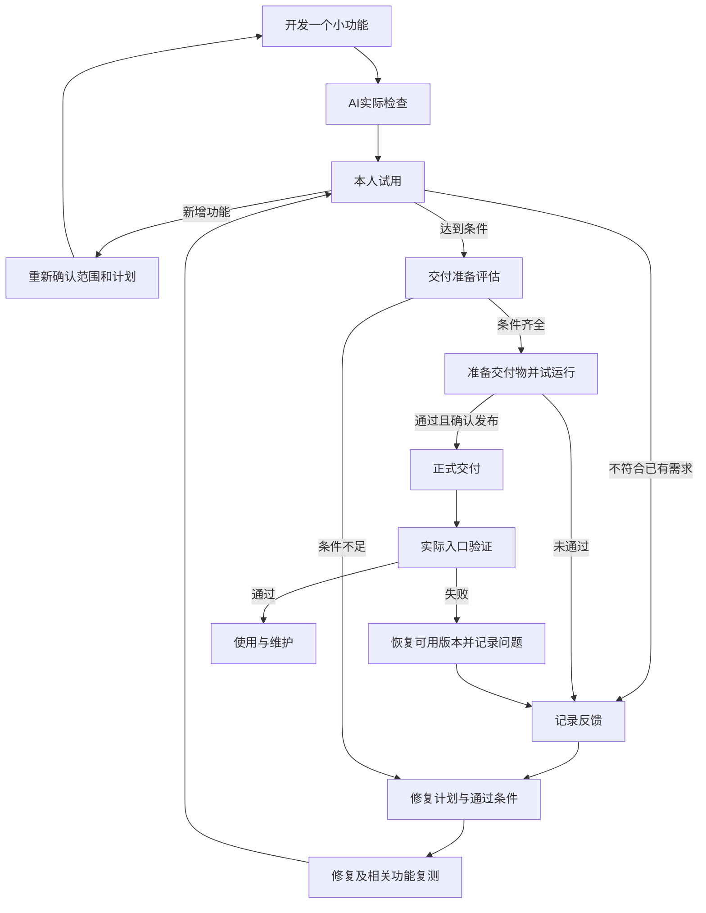

# Vibe Guide 新学习流程：每一站都留下可验证的成果

状态：流程设计 v2；已实施六成果入口、32 个动作的目的与概念解释、新增反馈/交付分支和模板。具体证据见 tasks/todo.md P33。依据用户流程、现有站点缺口与授权只读研究形成；不是整站提示词已验证的声明。

## 1. 核心目标

用户带着自己的想法进入，离开时得到一个经过本人试用、能再次打开或交付给目标用户的第一版作品，并能继续修改。完整流程按六个成果阶段呈现；每次只打开一个动作，不把下面的执行细目同时铺在路线图首页。

获得感来自五种真实变化：说得清 → 看得见 → 能操作 → 修得好 → 交得出。保存文档只是前期成果，不能长期替代可操作作品。网站仅保存学习材料和本人确认的进度，不声称自动检查了外部 AI 工具中的代码、文件或部署。

## 2. 六阶段与执行顺序

### 第一站：把想法变成自己的项目说明

**用户得到：一份能直接交给 AI 的项目说明。**

1. 填写项目用户、解决的问题、怎样实际试用才算通过、第二阶段的计划。补上项目名称和希望运行的平台；平台未知可保留。
2. 网站把填写内容组合成可编辑的项目描述。区分第一版必做、以后再做和未确定项；未填写的信息不能自动编造。此时不依赖外部 AI，避免“选工具前必须先有 AI”的循环。
3. 用户核对并确认，复制或下载。提供一个完整填写的练习示例，但不替换用户自己的目标。

通过条件：能说出一个真实使用者如何从开始操作到得到结果。卡住时展开单个字段的示例，不要求先懂 PRD、MVP 等术语。

### 第二站：选好工具，让项目真正落地

**用户得到：一个能读写实际文件的项目，以及能找回的起点。**

4. 先按系统、地区、项目类型和导出要求排除不可用工具，再按上手难度、免费额度、订阅开销、实际能力比较两个候选。已有可用工具优先试用，不强迫购买或换工具。
5. 安装/登录工具，创建项目文件夹并在工具中打开。网页构建平台走“新建云项目”的分支，说明本地文件、Git 与导出是否可用，不强套本机教程。
6. 在允许修改前建立最小合作规则：先读现有材料、保护已有文件、只做本次范围、报告真实检查结果。确认工具支持的规则入口；不能只凭文件存在就说规则已加载。
7. 做一个小而真实的试用：让 AI 保存项目说明，再亲手找到文件并读回。检查 Git 或平台版本记录，保存可恢复起点。没有 Git 身份、权限或版本能力时说明卡点，不伪报已提交。

通过条件：找到项目位置、实际文件和起点版本。额度不足进入“保存交接 → 等待恢复/更换工具”分支，保留同一项目，不从零重建。

### 第三站：确定第一版，并提前看见它

**用户得到：已确认的范围、一条完整使用流程、看得懂的界面示意和开发计划。**

8. 把项目说明交给 AI，请它一次问一个影响范围的问题。对模糊回答给具体选项，不连续抛出十几个技术问题。
9. 确定第一版只解决的核心任务。把使用者、操作顺序、正常结果、失败结果写清楚。用户故事用“谁在什么情况下，要做什么，为什么”表达，不强迫学习格式术语。
10. 对有界面的项目先做一张关键页面草图或轻量可交互原型，核对入口、操作、结果、返回、空白/失败提示与移动端排列。无界面任务改为输入输出样例。明确原型是否只有演示，不能称为已完成存储、登录或权限。
11. AI 根据目标平台、数据保存、共享/登录需要、预算和交付渠道给出简单实现方案。说明推荐理由、限制与将来改变的代价。上线平台约束在这里检查，不等代码写完才发现无法交付。
12. 生成需求、用户故事、技术设计与开发计划，核对彼此一致。小项目允许前两者合并；复杂项目再拆文档。只把当前阶段拆细，后续保留方向。每项任务写明产物、检查步骤、通过条件和范围外事项。

通过条件：用户能确认第一版做什么、不做什么；第一项任务可实际检查，而不是“完成前端”。原型和最终作品的区别始终可见。

### 第四站：做出一条真正能用的流程

**用户得到：自己的第一个可操作版本。**

13. AI 先检查现有系统、运行工具、依赖版本和启动方式，只安装方案实际需要的东西。补齐项目规则中的运行和检查命令，建立能启动的最小结构。
14. 完成计划中的第一条纵向流程：例如输入 → 保存 → 再次查看，而不是先做一堆无行为的页面。提供真实路径/地址、启动方式、已完成和待完成项。
15. 每完成一个小任务，AI 执行相关检查，用户亲手试用一次，再保存版本。按项目需要检查空白输入、失败反馈、重复操作、重新打开；有共享数据再检查身份和访问权限，不为本机练习硬加服务。

通过条件：用户独立完成自己定义的核心任务。AI 无法运行某项检查时写明未验证，并给本人可执行的检查方法。不能用构建通过替代运行或使用成功。

### 第五站：把问题变成可验证的改进

**用户得到：一份有证据的反馈清单和经过本人复测的版本。**

16. 本人按需求做完整试用，用结构模板记录版本/设备、操作步骤、预期结果、实际结果和截图。已经通过与未测试同样保留，避免只剩问题列表。
17. AI 整理反馈：原需求未达到是缺陷；新增想法回到范围确认；证据不足先复现。制定修复计划，每个问题带编号、影响、修复范围、通过条件和受影响功能的复测方法。先计划再修复。
18. AI 按计划修复，重跑原失败场景和相关正常场景，报告证据、版本、未解决项；不得代替本人填写“人工通过”。
19. 本人重新试用。未通过返回反馈/修复循环；新增需求回到范围确认。达到已确认条件后进入交付。严重问题不能按“以后再说”绕过；轻微问题可明确记录，由用户决定是否接受。

通过条件：没有未处理的发布阻断项；未测项和接受的限制清楚记录。不是“永远没有任何 bug”。

### 第六站：交付、再次验证，并知道以后怎么办

**用户得到：可用的交付入口，以及启动、更新、恢复和维护说明。**

20. 选择交付方式并评估准备情况：仅自己用、网页公开访问、桌面安装包、移动应用/小程序。检查实际适用的费用、配置、数据、权限、备份、渠道要求和失败恢复方式。未满足返回修复计划；不把不相关条目强塞给所有人。
21. 制作交付物：网页优先采用适合的平台构建/部署方式，需要时再做脚本；桌面做目标系统安装包；移动/小程序按目标平台要求准备。先试部署/试安装，由本人核对核心功能和数据保留，再确认正式发布。脚本生成成功不等于部署成功，包构建成功不等于可安装。
22. 正式发布后，从目标用户的入口再验一次：能打开/安装、完成核心操作、资料仍在、权限符合预期。记录实际版本和地址；失败时按已准备的方案恢复，而非继续宣称上线成功。
23. 留好使用和维护说明：重新打开、备份与恢复、费用/到期提醒、问题反馈入口、下一项任务。新功能从需求重新循环；对业务数据的备份不能用 Git 代码提交冒充。

通过条件：交付方式与使用人群一致，实际入口可用，能说明出了问题如何恢复。仅自用也可以完成本阶段，不以公网发布作为唯一毕业条件。

## 3. 用户在页面上看到什么

路线图只展示六张成果卡，每张包含一句成果说明和一个进入按钮。阶段页再显示子步骤；当前动作页固定为：

1. 这一步做完会得到什么（一个具体结果）。
2. 在哪里操作（站内、AI 对话、项目文件夹、预览或发布平台）。
3. 当前一个动作：结构表单/可编辑模板，填完确认生成，再一键复制。
4. 应该看到什么：真实截图、文件结构或结果示意；演示与实际截图明确区分。
5. 三个出口：“已实际核对，继续”“结果不一样，按现象解决”“保存，稍后继续”。

必要操作默认可见；解释、完整示例、术语、替代工具和问题细节按需展开。较长的项目描述采用分项字段，而不是一个塞满说明的大输入框。每个字段只给一个最相关例子。

阶段完成展示“本次新增的成果”及下一步用途，例如：“已有项目说明，下一步把它交给工具”；“已经保存的测试记录刷新后仍在”。文件/网址由本人填写或确认，网站不能伪装已读取本机项目。成果记录至少含项目、阶段、产物位置、版本、本人核对状态、未验证项；默认保存在当前浏览器并可导出，避免换设备丢失预期。

不使用虚假的成功动画或固定完成百分比掩盖卡点。不承诺几分钟做成；文档阶段应尽快转入原型和真实运行，避免连续填很多表却看不到作品。

## 4. 两个必须可点击的循环

## 5. 文档与提示词的交接约定

以下文件名是站点默认示例；已有项目使用原有等效文件并明确映射，不再制造第二套真相源。

| 材料 | 用途 | 谁确认 |
| --- | --- | --- |
| idea.md | 项目目标、用户、问题、第一版和以后范围 | 用户 |
| docs/requirements.md | 实际行为和通过条件，可包含用户故事 | 用户确认范围，AI整理 |
| docs/design.md | 界面/数据/实现/交付选择与限制 | AI说明取舍，用户确认关键影响 |
| tasks/todo.md | 当前任务、依赖、检查办法和实际状态 | AI更新，用户验收成果 |
| docs/feedback.md | 用户试用的原始事实与问题编号 | 用户 |
| docs/repair-plan.md | 对应问题的修复任务和复测条件 | AI制定，用户确认范围变化 |
| docs/checks.md | 自动检查和人工检查的真实结果，分开记录 | 各自记录，不互相冒充 |
| docs/release.md + README.md | 交付版本、入口、使用、恢复、维护 | AI准备，用户确认交付 |

每份给工具的提示词必须交代：已有材料、本次目标、允许修改范围、输出位置、检查办法、未完成时怎么办。材料缺失先说明；不能凭空生成“已确认需求”。用户填写的事实、AI建议、本人已确认三种状态分开。

现有共享提示词组件还需专项复查：草稿不能跨项目混用；同一个帮助模板 ID 不应让不同步骤的求助内容串写；项目想法变化后，下游旧提示词应提示重新核对；外部生成器材料改变后不得复制旧结果。当前已存在编辑、确认与复制不等于这些跨阶段行为已经验收。

## 6. 关键提示词范例（流程设计稿）

### 把描述变成需求和用户故事

我正在制作自己的项目。请先读取 idea.md；找不到时说明，不要自行补造。
本次只讨论第一版，不写业务代码。先用普通话复述用户是谁、要解决什么问题，以及一条完整使用过程。存在会影响范围的疑问时，一次只问一个，并举实际例子。
得到回答后，整理必做、以后做和不做事项；给每项写出操作、预期结果和失败时的表现。用户故事可以合并在 docs/requirements.md 中。未经本人确认的内容标为待确认。报告保存位置和仍需本人决定的事项。

### 把当前阶段变成能验收的计划

请读取已确认需求和设计，先核对是否相互矛盾。只细化当前阶段，后续阶段保留方向。
在 tasks/todo.md 中为每项写：对应需求、开始条件、实际产物、本人怎样试用、什么结果算通过、AI能执行的检查以及本次不处理的事项。
第一项应尽快提供一条可以运行检查的小流程。先只整理计划，不开始开发。不适用的测试说明原因，不能为了凑测试数量重复实现逻辑。

### 按计划完成一个小功能

请先读取项目规则、已确认需求、设计和 tasks/todo.md，报告本次准备完成的任务及起点版本。只实施当前任务，保护已有工作。
完成后实际运行与本次变化有关的检查，提供准确的文件位置或预览入口、本人可复现的操作、真实结果和未验证项。检查失败先修复并重测；无法执行就说明原因。保存可追踪版本并更新任务记录，不擅自发布。存在范围变化先说明影响。

### 人工反馈模板

本次测试的版本/日期：【填写】
使用的设备、系统和入口：【填写】
测试的功能：【填写】
从哪里开始，依次做了什么：【填写别人照着能重复的步骤】
希望看到什么：【填写原需求中的结果】
实际发生了什么：【填写现象；不知道原因也没关系】
截图或报错原文：【附上；没有则写无】
是否每次发生：【是/偶尔/只试了一次】
对使用的影响：【完全做不了/可以绕开/只是外观或文字问题】
本次已经通过和还没有测试的部分：【分别填写】

### 根据反馈制定修复计划

请读取 docs/feedback.md、原需求和当前版本，先区分缺陷、新需求与材料不足。缺陷对应原有通过条件；新需求不要混入修复。
对每个问题给出编号、复现结果、原因证据或待验证推测、最小修复范围、原失败场景怎样才算通过，以及哪些原有功能需要重新检查。保存 docs/repair-plan.md。本次先规划，不写修复代码，不把用户的反馈改写成通过记录。

### 执行修复并交给本人复测

请按 docs/repair-plan.md 处理已确认的修复任务，逐项关联问题编号。修复后重跑原失败步骤和受影响的正常流程。
将实际检查结果和未执行项记录在 docs/checks.md，提供本次版本和本人复测步骤。不要代替本人标记人工通过。若需要改原需求或基础方案，先解释影响并暂停该部分；不覆盖无关工作。

### 上线准备评估

请读取需求、设计、最新检查和本人试用反馈，先确认本项目交付方式：【本人填写】。
仅检查适用条件：核心流程、阻断问题、真实配置、数据保存与权限、费用、目标平台要求、备份恢复、版本回退和使用说明。分别列出已核验、未满足、不适用和未验证项；说明每项证据。
把结果保存 docs/release.md。条件不足时转成带通过标准的准备/修复任务，不能直接宣布可以上线。本次不执行正式发布。

### 制作交付物并验证

请按已确认交付方案准备本项目的构建/部署配置或目标平台安装包。不要默认所有项目都需要 Docker 或一键脚本。
写明前置条件、费用、配置位置、执行位置、成功结果、失败日志和恢复办法。先在适当测试环境试部署/试安装并检查核心功能与数据保留，记录真实结果。不在仓库或交付包中写入真实密钥；正式发布仍需本人确认。

### 正式交付后的检查与维护

请核对已批准的版本和交付目标，再执行已授权的交付动作。交付后用实际网址或安装包复查用户的核心操作，记录版本、入口、检查结果和未验证项；失败按已确认恢复方案处理。
在 README.md 与维护记录中写清重新打开、备份和恢复、更新、费用到期、问题反馈和下一步。没有实现的能力标为待办。Git 保存代码版本，不代替用户业务数据备份。

## 7. 工具建议怎么呈现

默认只显示两个符合条件的候选；“查看更多”保留全库。每个候选相同四栏：

- 上手难度：实际需要几步、是否需终端/额外模型配置、能否容易找到项目与预览；标为本站判断，不伪装官方评分。
- 免费额度：是否可用来制作项目、按消息/积分/时间计算、重置方式、耗尽后怎样；未核验写未核验，免费安装不等于免费使用。
- 订阅开销：月付与年付分开，标币种；额外模型、超额用量与产品运行成本分开；显示官方来源及核对日期。
- 能力与限制：用同一任务核对建立项目、修改文件、运行检查、处理一次报错、导出和再次打开；不使用笼统“最强”。

推荐理由必须与用户条件对应；没有当前官方事实或本次实测支持时保留未知，不从旧知识库价格推断。配套填写“本次工具选择记录”，额度中断时给出交接模板。

## 8. 知识库研究后的取舍

本次只读研究，不修改或上传知识库原文。GBrain 两次搜索未返回可用命中，退出时报告断开超时；以下判断来自直接读取相关原文，不代表索引健康已恢复。

| 原文主题 | 吸收的方法 | 不直接沿用的内容 |
| --- | --- | --- |
| 用 AI 做开发的完整流程，上下篇 | 先说明范围与规则；只细化当前阶段；每个子阶段验收；需求变化回写依据 | 架构不能变的绝对说法改为先评估影响；不让所有小项目搭完整后端架构 |
| 零基础 App 教程与对应公众号稿 | 可看见的原型、版本起点、AI 自测加人工试用、额度中断的真实卡点 | 规则文件拼写错误；Git 不等于完整运行环境；自测通过不等于无缺陷 |
| AI 协作开发流程规范 | 开始前读记录、变更有依据、结束后留真实检查结果 | 特定项目的 TypeScript、目录和接口要求不作为全站通用条件 |
| Spec Kit 规划笔记 | 需求—澄清—方案—任务—实施，以及文档一致性核对 | 不要求新手先安装 Spec Kit；旧命令/依赖版本未核验，不进入教学操作 |
| AI 工具开发过程中最小化犯错 | 保护已确认事实，显式说明假设，限制本次范围 | 不普遍强制九份文档、REST、数据库、多层架构、Docker 或每个逻辑 TDD |
| 项目开发前如何选技术栈 | 从平台、预算、数据和维护条件选择 | 旧稿统一默认框架、个人设备假设、模型熟悉度排名不作为当前事实 |
| Docker 部署新手讨论 | 启动不等于部署完成；持久化、恢复、重启和真实入口验证 | 不把 Docker 设为默认，也不把密码交给 AI 当通用教程 |
| Vibe Guide 原始构想 | 每个节点有模板、示例与卡点解决；保留组件的视觉样例 | 不把站点变成只能读的资料目录 |

## 9. 站点实施与验收清单

1. 先实现六成果阶段、动作页固定结构、两条循环和交付分支；保留旧链接与知识。
2. 补齐缺失的项目描述、用户故事、反馈记录、修复计划、上线评估、交付验证和维护模板。明确模板之间传递的材料及版本。
3. 优先做用户填写到个人成果的闭环；修复跨项目/跨步骤草稿串用、旧模板未更新的问题。
4. 补工具四维对比及官方证据；按目标平台补操作图。没有真实截图时明确标示意，不冒充实录。
5. 检查中英文、手机布局、键盘操作、展开返回、草稿恢复和每个失败出口。
6. 用两条不同路径实际走通：本机练习项目；有交付渠道的项目。AI模拟与真实新手测试分开记录。
7. 真实新手验收看：能否找到下一步、能否找到产物、能否识别原型与成品、卡住后能否恢复、能否独立完成核心任务。记录首次出现障碍的位置、求助次数、恢复情况与完成结果，不预设完成率。

当前边界：主线页面已实施，但不代表所有第三方工具安装、每份提示词在外部项目执行、或真实新手独立完成均已验证。跨项目独立草稿与外部产物自动核验不在本轮实现内。

## 2026-09-27 已确认的断层补充（已实施并完成本地回归）

需求：按深度审计48项，在现有六阶段、31父步骤内补足新手操作、概念、材料交接、平台交付。保留原页面结构；用户已确认实施。
设计：步骤数据增加可折叠的输入/输出、操作小节、参考答案、恢复路径与术语链接；复杂能力和交付按适用分支展开。浏览器草稿隔离项目、显式带入已确认材料、完整导出/非覆盖导入。人工结果与项目版本绑定；固定提示词读真实文件，未知依赖先停止澄清。
验证：逐项内容覆盖；模板与资料传递回归；构建与现有验证；浏览器走想法→描述→起点、空模板、项目隔离/恢复、验收状态及交付分支。实际AI执行、真实设备/渠道发布及独立新手验收单独记录，不以构建成功替代。

结果：48项已映射实施，31步原理自测参考答案、12个能力/交付分支、材料交接及项目隔离备份已加入。check为0错误0警告（7条既有提示），build及verify通过2208页检查；浏览器验证范围与未验证边界见 `reviews/2026-09-27-workflow-audit/实施与验证记录.md`。本轮已实现跨项目独立草稿，取代上文旧阶段的范围说明。代码按现有上游origin/main交付。
